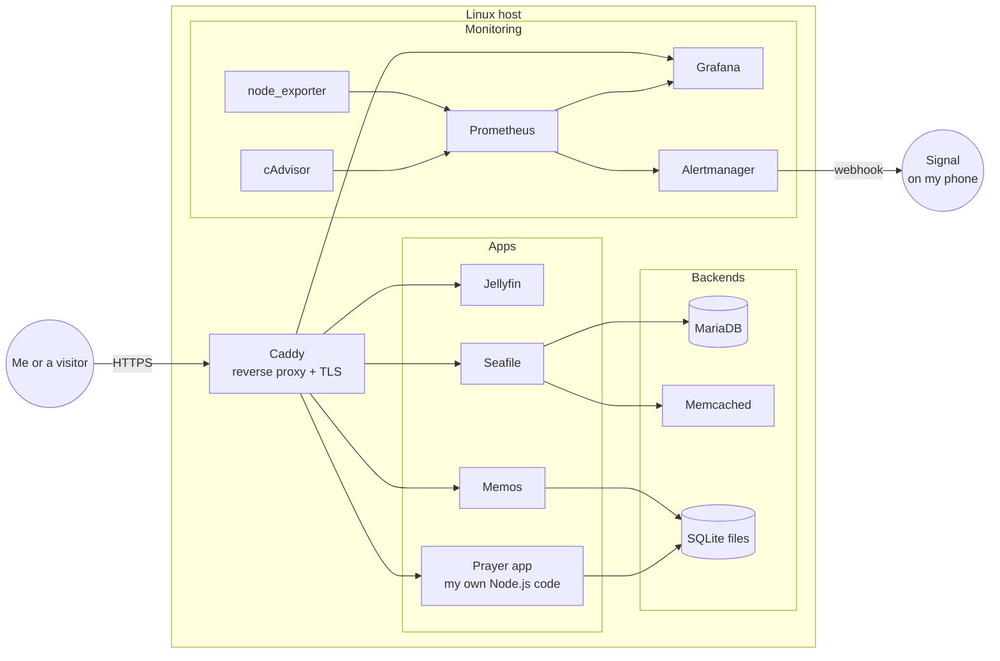
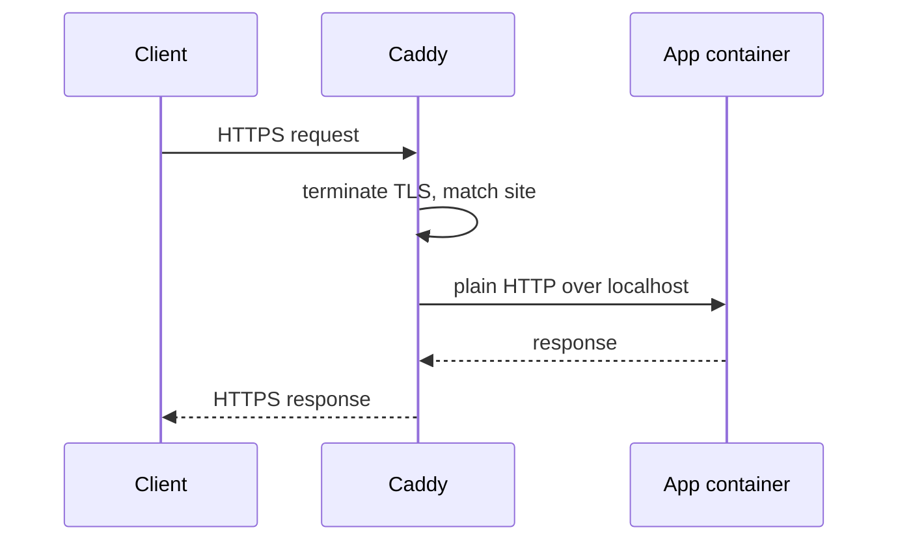
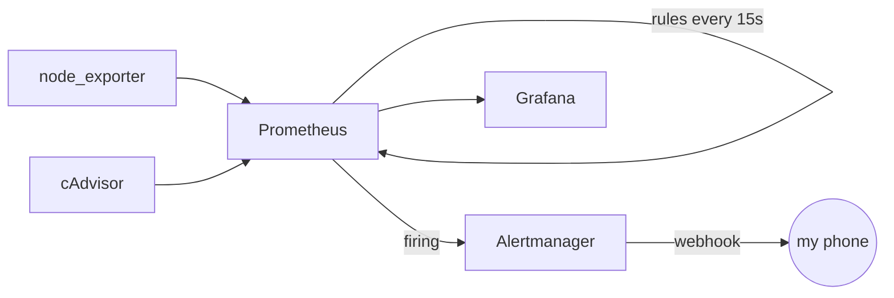

# Self-Hosted Application Node

This is the writeup for a small Linux server I run at home. It started out as a box just for Jellyfin, and over a few weekends I grew it into something that looks more like a miniature production environment: multiple apps, a reverse proxy with real TLS, and a full monitoring stack that actually pages my phone when something goes wrong.

I'm aiming for a Linux admin / SRE role, and I wanted a project where I had to make the same kinds of decisions those jobs make every day. Not just "get the app running," but: where does the data live, who can reach it, how do I know when it's broken, and how do I put it back.

## What it runs

The server hosts four apps and the monitoring stack that watches them.

The app I'm most proud of is a **prayer reminder app I wrote myself**. It's a small Node.js / Express service with a SQLite database and a couple of HTML pages, packaged with its own Dockerfile. I use it every day. It sits in the stack like any other service, behind the proxy, with its data on a mounted volume so rebuilding the container doesn't lose anything.

The other apps are Jellyfin for media, Memos for quick notes, and Seafile as a personal cloud drive. Seafile is the most complicated of the three because it also brings along MariaDB and Memcached, which was a good exercise in wiring up a multi-container app and making sure the database volume is something I can actually back up.

## How it's laid out

Everything lives under `/opt/app-node`, with one folder per service. This was a deliberate move away from running things out of my home directory. Putting application state in `/opt` is just how Linux servers are supposed to be organized, and it means the apps aren't tied to my user account.

```
/opt/app-node/
├── jellyfin/
├── memos/
├── seafile/
├── prayers/       <- my custom app
└── monitoring/
```

Each folder has its own `docker-compose.yml`. I can bring any service up or down on its own without touching the others. When I redeploy, I'm not remembering a checklist of flags — the compose file is the source of truth.

## The big picture



## The reverse proxy

Only one thing on the box listens on the public internet, and that's Caddy. Everything else binds to localhost or an internal Docker network. When I hit `memos.mydomain` in a browser, it lands on Caddy, Caddy terminates TLS, looks up the site block in the Caddyfile, and proxies the request to the right container on a local port.

I picked Caddy specifically because I didn't want to babysit certificates. It handles Let's Encrypt automatically, including renewal. For Seafile I had to add a little more to the site block — a 4 GB upload limit and the usual `X-Forwarded-*` headers — because otherwise uploads bigger than a few megabytes would die at the proxy.



## Monitoring, and why it's the part I care about most

Dashboards that look cool but don't tell you when something's actually broken are not useful. The point of this part of the project was to build something that would wake me up if a service went down, and then not wake me up when it didn't.

Prometheus scrapes two things: `node_exporter` for host-level numbers (CPU, memory, disk, network) and `cAdvisor` for per-container numbers. Grafana reads from Prometheus and draws the graphs. That part's the easy half.

The half that took more thought is `rules.yml`. Those are the alert definitions Prometheus evaluates every 15 seconds. I have four:

- A container using more than 80% CPU for two minutes
- A container using more than 85% of its memory limit for two minutes
- A container that restarted in the last five minutes (just an info, not a page)
- A container that cAdvisor hasn't seen in over a minute (critical, probably down)

When one of those fires, Prometheus hands it to Alertmanager, which posts to a webhook that sends a Signal message to my phone. I tested it by deliberately nuking a container and getting paged. It works.



## Things that broke, and what I did about them

I'm including this on purpose, because the interesting part of running servers isn't the green-check-everything-worked path — it's the stuff that didn't.

**Moving Jellyfin broke it.** I relocated the Jellyfin folder from my home directory into `/opt/app-node` and it wouldn't start. The reason was obvious in hindsight: the compose file still had the old bind-mount paths pointing at my home directory. Lesson learned — when I move a service, I grep the compose file before I start it.

**Seafile generated broken share links.** Uploads worked but share links pointed at the wrong host. Turns out Seafile stores the public URL internally and uses it to build links. I had to go into its admin settings and set `SERVICE_URL` and `FILE_SERVER_ROOT` to the externally-visible hostname.

**Large uploads died at Caddy.** Same story, different layer. Caddy has a default request body limit and my first Seafile upload over a few MB got chopped. Fixed with `request_body { max_size 4GB }` on the Seafile site block.

**My alerts didn't fire.** My `rules.yml` was loaded, nothing was alerting, everything looked right. The issue was that `evaluation_interval` was missing from the Prometheus config. Scrape and evaluate are two separate schedules — if you don't set the second one, rules never actually get checked. Added it, reloaded Prometheus, alerts started firing.

## Why I think this is worth showing

It's a small environment, but every piece of it maps onto something a working SRE or Linux admin does. I'm picking a clean place on disk to put things. I'm deploying from config files, not by poking at a running server. I'm putting a proxy in front of my apps instead of exposing their ports. I'm not trusting that things are fine — I'm measuring them, and I have alerts that will yell at me if they aren't.

If you want to ask me about any of it, my email's on my GitHub profile.

---

*The actual compose files, Caddyfile, and monitoring configs live on the server and aren't published here. This repo is the writeup, not the deployment.*
